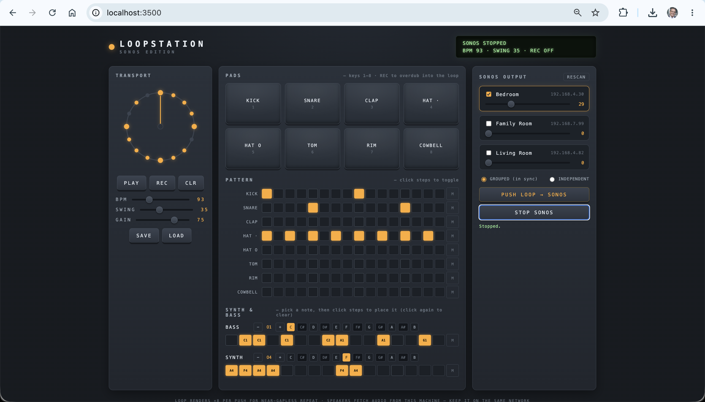
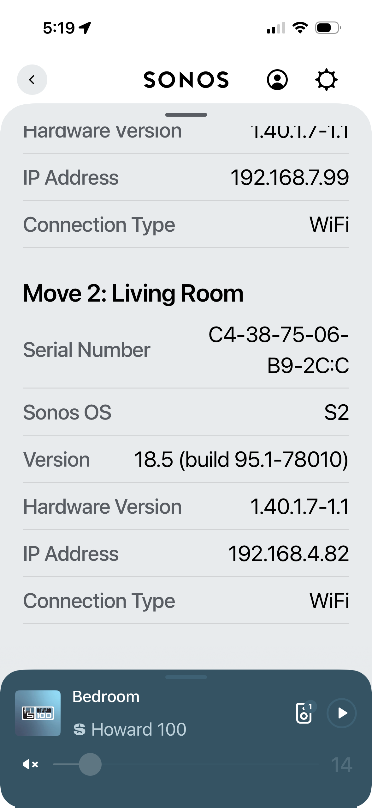

# Sonos Loopstation

> A browser-based loop synthesizer / drum machine — 8 synthesized drum voices plus
> BASS and SYNTH note lanes — that renders your groove to a WAV and loops it on
> your Sonos speakers (Era 100, Move 2, or any S2 device), with per-speaker
> volume control.



## How it works (and why)

Sonos speakers can't accept a low-latency live audio stream — they only play
media from URIs and buffer heavily. So this app splits the experience in two:

1. **Jam in the browser.** All drum voices (kick, snare, clap, hats, tom, rim,
   cowbell) and the bass/synth lanes are synthesized live with the Web Audio
   API — no samples. A 16-step loop plays continuously; hit **REC** and tap
   pads (or keys `1`–`8`) to overdub quantized hits, or program steps and
   notes directly in the grids.
2. **Push to Sonos.** **PUSH LOOP → SONOS** renders the pattern offline to a
   16-bit WAV (repeated ×8 inside the file for near-gapless looping), the
   Express backend saves it and hands your speakers a
   `http://<your-mac-lan-ip>:3500/loops/…` URL, then queues it with
   `REPEAT_ALL`. **The speakers fetch the audio directly from your machine** —
   this detail drives most of the setup below.

Sonos control uses the local UPnP interface via
[`@svrooij/sonos`](https://github.com/svrooij/node-sonos-ts) — no Sonos
developer account, no cloud, no API keys.

```
Browser (Web Audio)            Express (Node)                 Sonos (LAN)
┌─────────────────┐  WAV POST  ┌──────────────────┐  UPnP     ┌──────────┐
│ pads · lanes ·  │──────────▶│ /api/loop (save)  │─────────▶│ Era 100  │
│ looper · render │  JSON      │ /api/play /stop   │  HTTP GET │ Move 2   │
│ speaker panel   │◀──────────│ /api/speakers     │◀──────────│  ...     │
└─────────────────┘            │ /loops/*.wav      │  (fetch)  └──────────┘
                               └──────────────────┘
```

## Requirements

- Node.js 18+
- **The machine running this app must be on the same network as your Sonos
  speakers.** This will not work from a GitHub Codespace — discovery is
  multicast SSDP and the speakers must be able to reach this machine over
  HTTP to fetch the loop audio. Run it locally.

## Setup

### 1. Install and create your .env

```bash
npm install
cp .env.example .env
```

### 2. Find your Mac's LAN IP address

This is the address the Sonos speakers will fetch loop audio from:

```bash
ipconfig getifaddr en0        # Wi-Fi on most Macs, e.g. 192.168.4.61
```

(If you're on Ethernet or `en0` returns nothing, try `en1`, or check
System Settings → Network.)

Set it in `.env` so auto-detection can never pick the wrong interface
(VPNs and Docker bridges are common false positives):

```
HOST_IP=192.168.4.61
```

### 3. Find a Sonos speaker's IP address

You only need **one** — the app learns your whole Sonos household from a
single speaker's zone topology. Any of these works:

**Sonos app (post-redesign location):** tap the **gear icon** on the main
page, then tap **Manage** next to your system name → **About My System**.
Each speaker is listed with its IP address.

  

**Terminal port sweep** — every Sonos device answers HTTP on port 1400.
Replace `192.168.4` with your subnet (the first three numbers of your Mac's
IP from step 2):

```bash
for i in $(seq 1 254); do
  (curl -s -m 1 http://192.168.4.$i:1400/xml/device_description.xml \
    | grep -o '<roomName>[^<]*' | sed "s|<roomName>|192.168.4.$i  →  |") &
done; wait
```

This prints the IP and room name of every Sonos device on the network.

**Bonjour/mDNS:**

```bash
dns-sd -B _sonos._tcp local.     # Ctrl-C to stop
```

**Sanity check** — confirm your Mac can reach the speaker:

```bash
curl http://<SPEAKER_IP>:1400/xml/device_description.xml
```

If that returns XML, you're good. Tip: give your Sonos devices DHCP
reservations in your router so these IPs never change.

### 4. Set SONOS_HOST (recommended)

Multicast discovery is often blocked on macOS (see networking notes below).
Bootstrapping from a known speaker IP is more reliable:

```
SONOS_HOST=192.168.4.30
```

All speakers will still appear — this just replaces the discovery step.

### 5. Run it

```bash
npm start
```

The startup log prints both URLs — verify the LAN one shows your real IP:

```
Local:   http://localhost:3500
LAN:     http://192.168.4.61:3500   <- Sonos fetches audio from here
```

Open http://localhost:3500. **When macOS asks whether `node` can accept
incoming network connections — click Allow.** Without it, speakers can't
fetch the audio and pushes will "succeed" silently.

## macOS networking notes (read if anything doesn't work)

- **Local Network permission** — recent macOS gates LAN access per app.
  System Settings → Privacy & Security → **Local Network** → enable the app
  you run `npm start` from (Terminal, iTerm, VS Code), then fully quit and
  reopen it. If this is off, discovery fails and even `curl` to a speaker
  can hang.
- **Firewall** — System Settings → Network → Firewall. If enabled, `node`
  must be allowed to accept incoming connections, or the speakers can't
  fetch loops.
- **VPNs** — a work VPN can hijack both discovery and IP auto-detection.
  Setting `HOST_IP` and `SONOS_HOST` explicitly sidesteps most of it, but
  disconnect if things are flaky.
- **Router AP/client isolation** — guest networks and some mesh setups block
  device-to-device traffic entirely; nothing here can work around that.

## Using it

| Control | What it does |
|---|---|
| **PLAY** (or Space) | Start/stop the browser loop |
| **REC** | Arm overdub — pad hits are quantized to the nearest 16th and written into the loop |
| Pads / keys `1`–`8` | Trigger a drum voice (always audible; recorded only when REC is on) |
| Pattern grid | Click any cell to toggle a hit; `M` mutes a track |
| **BASS / SYNTH lanes** | Pick a note (it auditions), set the octave with −/+, then click steps to place it. Clicking the same note again clears the step; a different note replaces it |
| **SWING** | Delays every other 16th — 25–40 is a classic shuffle |
| **SAVE / LOAD** | Download the whole pattern (drums, note lanes, mutes, BPM, swing, gain) as JSON / restore it |
| **CLR** | Wipe the pattern, including the note lanes |
| BPM / GAIN | Tempo and master output level (applies to the render too) |
| Speaker checkboxes | Choose which speakers receive the loop |
| Per-speaker slider | Sets that speaker's volume directly (works any time) |
| GROUPED vs INDEPENDENT | Grouped joins the selected speakers so playback is sample-synced; independent plays on each separately (they may drift) |
| **PUSH LOOP → SONOS** | Render → upload → loop on the selected speakers |
| **STOP SONOS** | Stops (and ungroups) the selected speakers |

## API

| Method | Path | Description |
|---|---|---|
| GET | `/health` | Service health |
| GET | `/api/speakers` | Discovered speakers: uuid, name, host, group, volume |
| POST | `/api/speakers/:uuid/volume` | `{ "volume": 0-100 }` |
| POST | `/api/loop` | Raw `audio/wav` body → saved, returns LAN URL |
| POST | `/api/play` | `{ "uuids": [...], "url": "...", "mode": "grouped"\|"independent" }` |
| POST | `/api/stop` | `{ "uuids": [...] }` |

## Environment variables

| Var | Default | Purpose |
|---|---|---|
| `PORT` | `3500` | HTTP port |
| `HOST_IP` | auto-detected | Your Mac's LAN IP, used in loop URLs handed to Sonos. Set it explicitly — auto-detection can pick a VPN or virtual interface |
| `SONOS_HOST` | unset (multicast discovery) | IP of any one Sonos speaker; the full household is learned from it. Set it — more reliable than multicast on macOS |

## Troubleshooting

- **No speakers found** — work through the macOS networking notes above,
  then set `SONOS_HOST`. Verify reachability with the `curl ...1400/xml/...`
  sanity check.
- **Push succeeds but no sound** — the speaker can't fetch the WAV from your
  Mac. Confirm the `LAN:` startup line shows your real IP (set `HOST_IP`),
  then test reachability from another device: open
  `http://<HOST_IP>:3500` on your phone. If it times out, it's the firewall
  or Local Network permission. The Sonos app is also diagnostic: a
  `loop-...wav` track stuck at 0:00 = fetch blocked; playing but silent =
  speaker volume.
- **Tiny hiccup between repeats** — the WAV contains 8 copies of the loop,
  so any repeat gap only occurs at the file boundary. Raise
  `RENDER_REPEATS` in `public/app.js` to stretch that interval further.
- **Speakers out of sync** — use GROUPED mode; independent playback has no
  clock sync between devices.
- **Move 2 on battery away from Wi-Fi** — it must be on the same network;
  Bluetooth mode won't work with this app.

## Ideas to extend

- Per-track velocity and accent steps
- More bars (32/64 steps) and multiple pattern slots with chaining
- A third melodic lane, or chords on the synth lane
- MP3 encoding (e.g. `lamejs`) for smaller uploads
